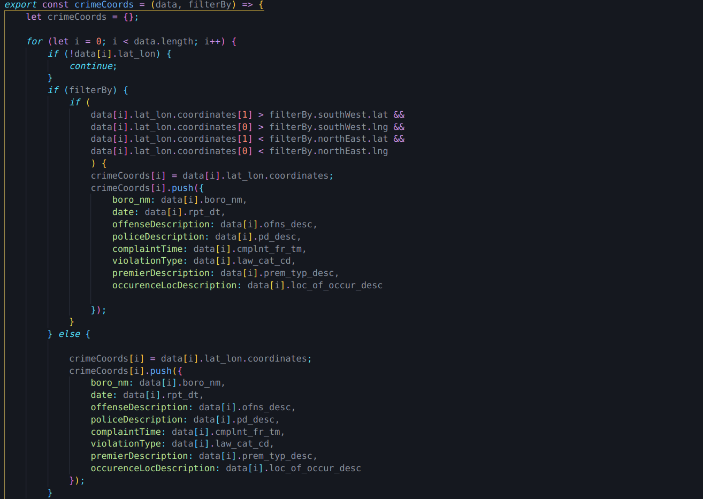
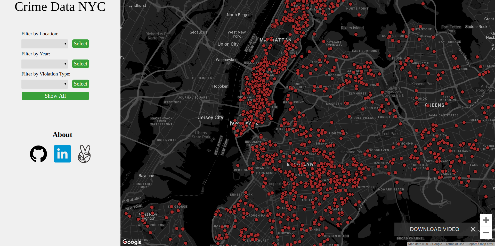
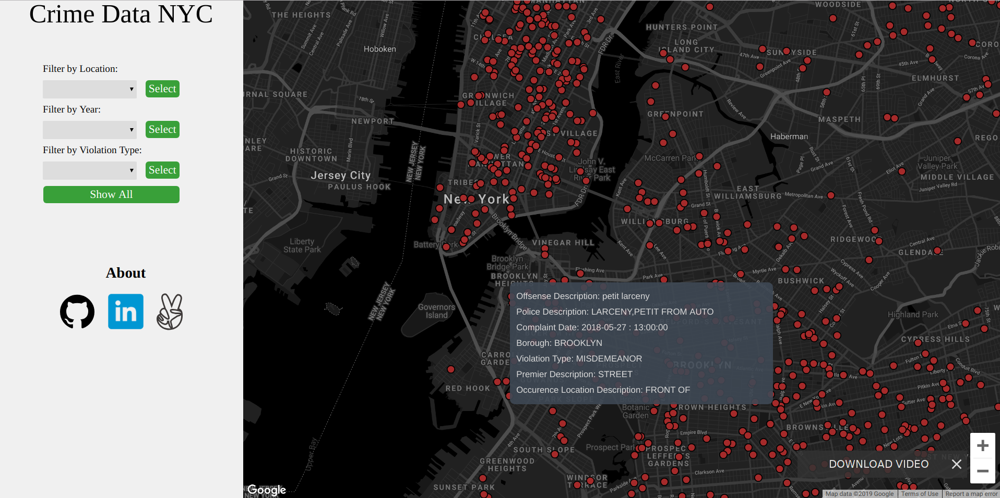

# Crime Data visualization

Link to live site:
- https://skeiromar.github.io/Crime-Data-Visualization/

### Technologies

This project is implemented with the following technologies:

- `JavaScript` and `D3` for logic
- `HTML5` for rendering the page
- `Google Maps API` and `D3` for rendering the map and its elements

### Background

Crime data visualization is a visualization website that shows the crime data in NYC from 2006 to 2018 It is useful for 
understanding crime trends in New York city via the toggling of different factors. 

### Features  

Users will be able to:
- [x] visualize the crime data using svg markers
- [x] Identify areas with dense crime activity
- [x] Filter by types of crimes
- [x] Filter by location of crimes
- [x] See how crime data changed over the years

### Getting Started

The app will consist of controls on the left side and a map on the right. The map will reflect the controls on the left side.
By default you will be taken to a map of NYC with crime data as various svg markers planted using D3, throughout NYC.

### Filter By 

- [x] Filter by location - display crime data across the borough specified
- [x] Filter by Year - display crime data in the year specified
- [x] Filter by types of crimes - display data based on the type of crime

### Screenshots
This helper method shapes the passed data into a form that can be used by D3 to render onto Google Maps either by Google Maps bounds or otherwise. 

Screen the visitor is welcomed by

Clicking any dot shows the details of that crime

